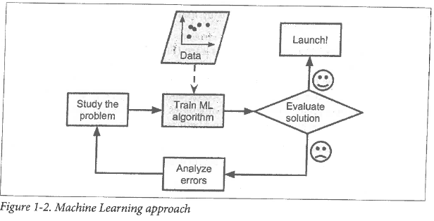
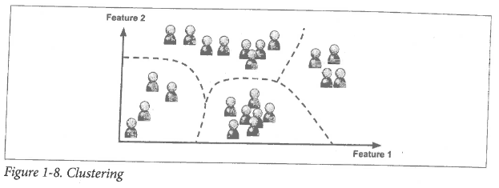
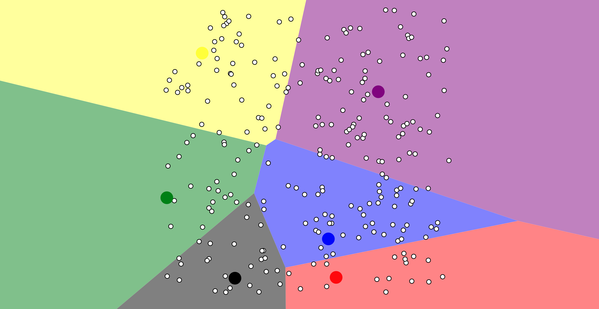

## What is Machine Learning?

Simply put, machine learning is the science of programming computers so they can _learn from data_. 

* (Aurthur Samuel, 1959) Machine learning is the field of study that gives computers the ability to learn without being explicitly programmed. 

## Example: The SPAM filter

## Naive approach

* You notice _4U_, _free_, _amazing_ are used a lot
* Then write code to stop these emails

----

But if the spammers notice they are being blocked, they will start using _4 you_ instead.

* If this happens you need to write more rules
* Your code will become exponentially large and unmanageable. 
* Thankfully there is a better way. 

## ML Approach

* All of this can be automated!

-------

Blocking SPAM is not the only thing ML is good for.  You can use it for

* Problems for which existing solutions require a lot rules
* Complex problems where there is not good traditional solutions
* Fluctuating environments
* Getting insights about large amounts of data
* Differentiating dog and cat pictures

## There are three main tasks. 

- Supervised
- Unsupervised
- Reinforcement

## Supervised Learning

----

Types of supervised learning include: 

- Regression
- Decision Trees
- Random Forests
- Support Vector Machine
- Neural Networks

## Unsupervised Learning

--------

Types of unsupervised learning include: 

- k-clusters
- Principle Component Analysis
- Expectation Maximization
- t-distributed Stochastic Neighbor Embedding
- Apriori
- Eclat

## Reinforcement

- AI
- AlphaGo

## Example: K-Clusters

1. k points of the data are chosen to be centroids.
2. Distances between every point and the k centroids are calculated and stored.
3. Each data point is then assigned to the nearest cluster
4. New cluster centroid positions are updated: similar to finding the mean of the points
5. If the centroid locations changed, the process repeats from step 2, until the calculated new center stays the same, which signals that the clusters' members and centroids are now set. 

## K-Clusters in action

## Uses K-Clusters

1. Image Segmentation and patters recognition
2. Grouping Comments from the news
3. Grouping inventory by sales activity
4. Clustering animals by movement
5. Bot Detection

## Objective function

Formally we are trying to minimize the following:

$$
J=\sum_{j=1}^K \sum_{n \in S_j} |x_n-\mu_j|^2.
$$

Here we are clustering $N$ data points into $K$ disjoint subsets $S_j$ containing $N_j$ data points. 

* $x_n$ is a vector representing the $n$th data point
* $\mu_j$ is the geometric centroid of the data points in $S_j$. 

## Supervised Classification

Time for an activity!

## Support Vector Machines

An example of linearly separable data. 

----

To find our plane of separation, we maximize $r$, the closest distance from our plane $\langle w,x\rangle + b = 0$. Here think of the $\langle w,x\rangle$ as the dot product. 

--- 

## SVM Formal Problem

* $w$ is our normal vector defining the plane, 
* $x_n$ is a data point vector
* want $\langle w,x\rangle + b > 0$ or $\langle w,x\rangle + b < 0$
* so let $y_n = \pm 1$.

----

## Deep Learning

----

-----

## Questions!

* Where did the $w_i$'s come from?
* Why in the world is $\hat y$ relevant?
* Probably more...

## Answer: Loss Function

For each training example $(x^{(i)}, y^{(i)})$, we want:

$$
\widehat{y}=\sigma(w^{T} \cdot x + b)
$$ 

so that $\widehat{y} \approx y^{(i)}$. We need to compute the error of our model. Traditionally, the most used loss function is:

$$ 
L(\widehat{y}, y) = \frac{1}{2} (\widehat{y} - y)^2 
$$

----

## Total loss (function)

$$J(w, b) = \frac{1}{m} \sum^{m}_{i=1} L(\widehat{y}^{(i)}, y^{(i)})$$

We refer to this as the _cost_ function, whereas the _loss_ function references a single example. Our goal is then to find $(w, b)$ that minimize $J$.

## Gradient Decent

The gradient, $\nabla J$, helps us find the minimum value of the cost function. As our cost function is concave up, we can iteratively compute new values for $(w,b)$ via the assignment
$$
\langle w,b \rangle := \langle w,b \rangle - \alpha \nabla J(w,b).
$$
