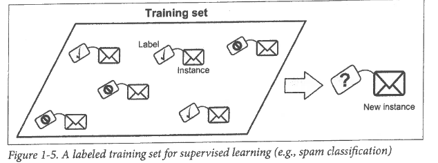
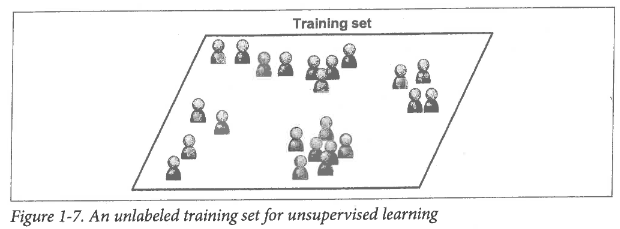
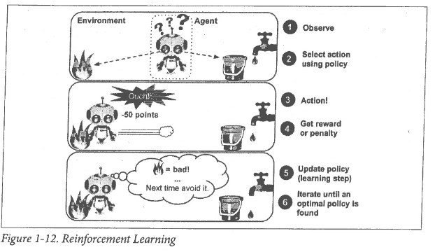
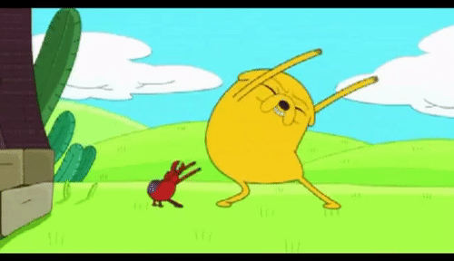
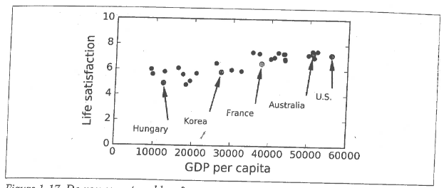
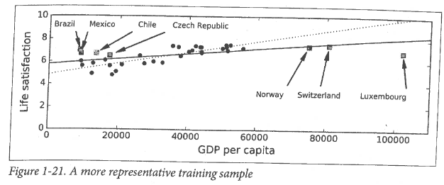
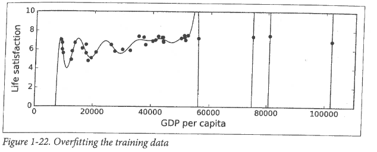

## What is Machine Learning?

Simply put, machine learning is the science of programming computers so they can _learn from data_. 

* (Aurthur Samuel, 1959) Machine learning is the field of study that gives computers the ability to learn without being explicitly programmed. 

## Example: The SPAM filter

## Naive approach

* You notice _4U_, _free_, _amazing_ are used a lot
* Then write code to stop these emails

----

But if the spammers notice they are being blocked, they will start using _4 you_ instead.

* If this happens you need to write more rules
* Your code will become exponentially large and unmanageable. 
* Thankfully there is a better way. 

## ML Approach

* All of this can be automated!

-------

Blocking SPAM is not the only thing ML is good for.  You can use it for

* Problems for which existing solutions require a lot rules
* Complex problems where there is not good traditional solutions
* Fluctuating environments
* Getting insights about large amounts of data
* Differentiating dog and cat pictures

## There are three main tasks. 

- Supervised
- Unsupervised
- Reinforcement

## Supervised Learning

----

Types of supervised learning include: 

- Regression
- Decision Trees
- Random Forests
- Support Vector Machine
- Neural Networks

## Unsupervised Learning

--------

Types of unsupervised learning include: 

- k-clusters
- Principle Component Analysis
- Expectation Maximization
- t-distributed Stochastic Neighbor Embedding
- Apriori
- Eclat

## Reinforcement

- AI
- AlphaGo

## Example: K-Clusters

1. k points of the data are chosen to be centroids.
2. Distances between every point and the k centroids are calculated and stored.
3. Each data point is then assigned to the nearest cluster
4. New cluster centroid positions are updated: similar to finding the mean of the points
5. If the centroid locations changed, the process repeats from step 2, until the calculated new center stays the same, which signals that the clusters' members and centroids are now set. 

## K-Clusters in action

## Uses K-Clusters

1. Image Segmentation and patters recognition
2. Grouping Comments from the news
3. Grouping inventory by sales activity
4. Clustering animals by movement
5. Bot Detection

## Objective function

Formally we are trying to minimize the following:

$$
J=\sum_{j=1}^K \sum_{n \in S_j} |x_n-\mu_j|^2.
$$

Here we are clustering $N$ data points into $K$ disjoint subsets $S_j$ containing $N_j$ data points. 

* $x_n$ is a vector representing the $n$th data point
* $\mu_j$ is the geometric centroid of the data points in $S_j$. 

## Supervised Classification

Time for an activity!

## Support Vector Machines

Use the grapher nb for motivation, maybe just give the optimization problem, define the terms, and say the kernel trick is choosing the correct mapping, just like minimizing distance in calc. 

## Deep Learning

<!-- ## Example: Life Satisfaction

Can we find parameters $\theta_0$, $\theta_1$ for 

$$lifeSat = \theta_0+\theta_1 \cdot GDP?$$

-----

There are infinitely many to choose from, but there can be only one.

-----

* The problem is, does this extend well when more data is added? 
* Turns out more countries exist!

------

* The dotted line is our old model.
* But when we refit with new data, we get a different line.
* Notice it does not do such a great job for "poor" Luxembourg. 

## Challenges of ML

* Not enough training data.
	* Turns out all models perform the same when given enough data.
* Bad representation in data (Sampling Bias)
	* Page 25 has a nice example of this.
* Poor Quality Data 
	* Missing information
	* too many outliers
* Irrelevant Features
* Overfitting training data

----

An example of overfitting using the Lagrange polynomial.

---

Overfitting happens when the model is too complex relative to the amount of noisiness of the training data. Solutions are 

* Simplify the model by selecting hone with fewer parameters (maybe just use $\theta_1$?)
* Gather more data (very expensive)
* reduce the noise (fill in missing info, remove outliers)

-----

In our situation, if we place bounds on $\theta_1$, we can then have two variables to "move around". This process is called **regularization**.

 -->